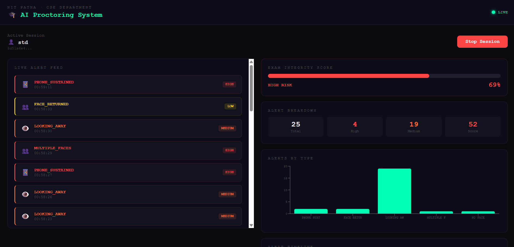

# 🎓 AI Proctoring System

A real-time AI-powered proctoring system that detects suspicious behavior 
during online exams — without storing any raw video footage.

Built as project .

---

## 🚀 Live Demo
> Coming soon — will be updated after deployment

---

## 🔍 What It Does

- 👁️ **Gaze Detection** — flags when student looks away from screen
- 👥 **Multiple Face Detection** — alerts when another person enters frame  
- 📱 **Phone Detection** — detects mobile phones using YOLOv8
- 🎤 **Audio Detection** — flags speech and background voices
- 🔒 **Privacy First** — zero raw video stored, only behavioral metadata

---

## 🛠️ Tech Stack

|       Layer      |    Technology    |
|------------------|------------------|
| Face & Gaze      | MediaPipe        |
| Object Detection | YOLOv8           |
| Audio Analysis   | WebRTC VAD       |
| Backend API      | FastAPI + SQLite |
| Frontend         | React + Vite     |
| Deployment       | Render + Vercel  |

---

## 📁 Project Structure

ai-proctoring-system/
├── backend/
│   ├── models/       # AI model files
│   ├── services/     # Detection logic
│   ├── api/          # FastAPI routes
│   └── utils/        # Helpers & logger
├── frontend/         # React dashboard
├── data/             # Logs & processed data
├── docker/           # Dockerfile
└── scripts/          # Utility scripts

---

## ⚙️ How to Run Locally

```bash
# Clone the repo
git clone https://github.com/yourusername/ai-proctoring-system.git
cd ai-proctoring-system

# Create virtual environment
python -m venv venv
source venv/bin/activate  # Windows: venv\Scripts\activate

# Install dependencies
pip install -r requirements.txt

# Run backend
uvicorn backend.api.main:app --reload
```

---

## ✅ Progress

### Week 1 — Complete ✅
- Face detection with OpenCV
- Gaze detection with eye tracking
- Multi-face and no-face alerts

### Week 2 — Complete ✅
- Phone detection with YOLOv8
- Voice activity detection
- All 4 detectors running simultaneously
- Event logger saving to JSONL
- UI with status panel and corner brackets


## 📸 Screenshots
![Demo][def]



---

## 👩‍💻 Author
**Kanika** — NIT Patna, CSE


[def]: proctoring-system/docs/screenshots/week1.png